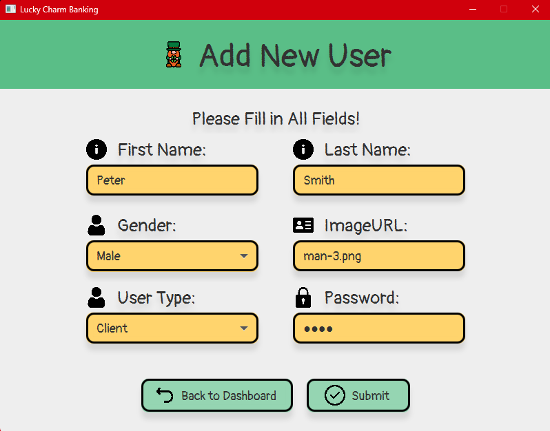
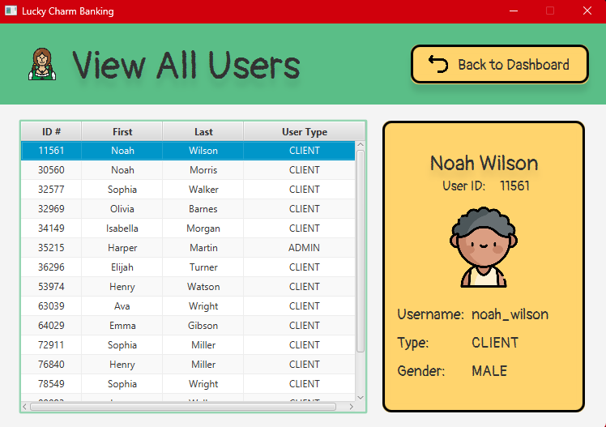

# Lucky Charms Banking

The Lucky Charms Banking System is an application built using the Model-View-Controller (MVC) architecture, written in Java programming language with JavaFX for User Interface (UI), and MySQL for database management. This application simulates basic banking functionalities. It allows users to create accounts, make deposits and withdrawals, send and transfer funds, and view their account balances. The system consists of two main views: the Admin view and the Client view.
Admin View
  - User Management: Admins have the ability to create and view user accounts.
Client View
  - My Accounts Overview: Clients can view/edit their User Profile and Account details, including Account Balances.
  - Deposits and Withdrawals: Clients can make ATM Deposits and Withdrawals to their Accounts.
  - Send and Transfers: Clients can send funds to other Clients' Account Numbers.

User Login Frame:

Admin & Client Dashboard Frame:

Manage My Accounts Frame and Edit Profile Client:

Add New User & Account Frame:

Transaction Frame:

View Clients Frame:

