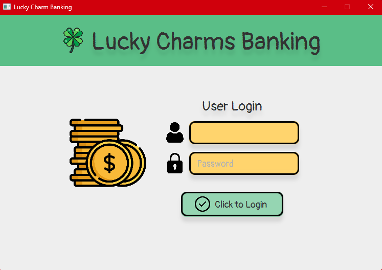
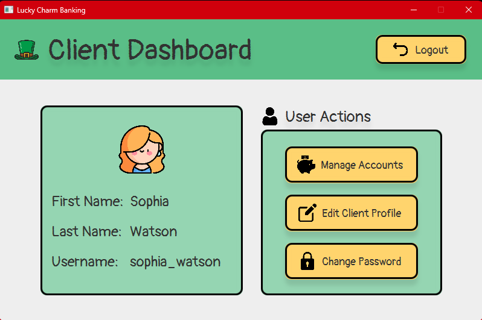
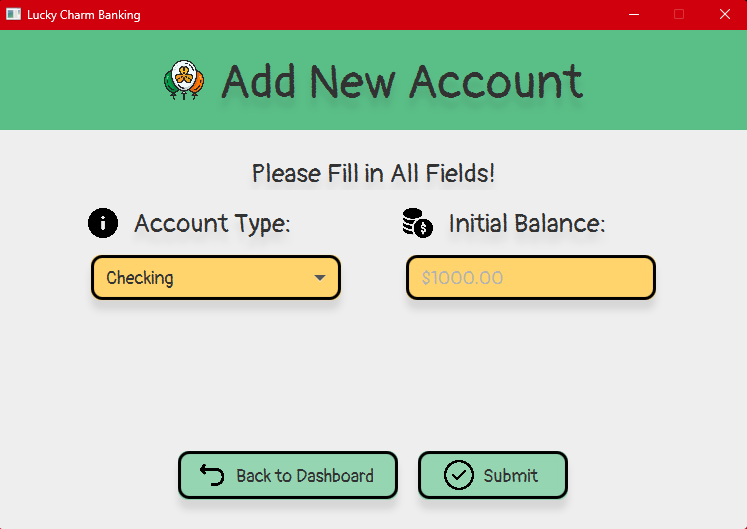

# Lucky Charms Banking

The Lucky Charms Banking System is an application built using the Model-View-Controller (MVC) architecture, written in Java programming language with JavaFX for User Interface (UI), and MySQL for database management. This application simulates basic banking functionalities. It allows users to create accounts, make deposits and withdrawals, and view their account balances. The system consists of two main views: the Admin view and the Client view.

Admin View
  - User Management: Admins have the ability to create and view user accounts.
Client View
  - Account Overview: Clients can view their account details, including balances.
  - Deposits and Withdrawals: Clients can make deposits and withdrawals to their accounts.

User Login Frame:

Admin & Client Dashboard Frame:

Add New User & Account Frame:

Transaction Frame:

View Clients Frame:

